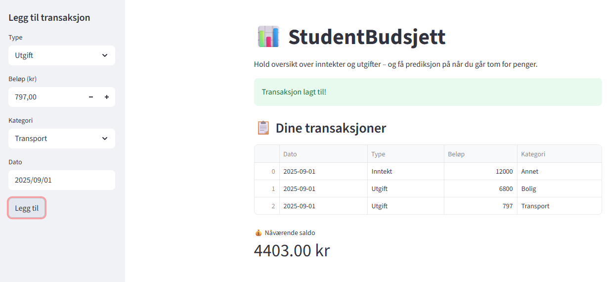

# 📊 StudentBudsjett / StudentBudget

StudentBudsjett er en mobilvennlig og brukervennlig budsjettapp for studenter, bygget med Streamlit og SQLite.  
StudentBudget is a mobile-friendly and user-friendly budgeting app for students, built with Streamlit and SQLite.

---

## 🖼️ Skjermbilde / Screenshot

  
*Legg inn et skjermbilde av appen her ved å laste opp `screenshot.png` i repoet.*

---

## 🚀 Kom i gang / Getting Started

### 🇳🇴 Norsk

```bash
git clone https://github.com/torbkle/studentbudsjett_app.git
cd studentbudsjett_app
pip install -r requirements.txt
streamlit run app.py
🇬🇧 English
bash
git clone https://github.com/torbkle/studentbudsjett_app.git
cd studentbudsjett_app
pip install -r requirements.txt
streamlit run app.py
Appen åpnes automatisk i nettleseren din. The app will open automatically in your browser.

🧰 Funksjoner / Features
🇳🇴 Norsk	🇬🇧 English
➕ Legg til inntekter og utgifter	➕ Add income and expenses
📄 Se oversikt over transaksjoner	📄 View transaction history
📊 Analyser budsjettet med sparetips	📊 Analyze budget with savings tips
📈 Visualiser saldo og utgifter	📈 Visualize balance and expenses
🔮 Prediksjon av når saldo når 0 kr	🔮 Predict when balance hits zero
📥 Generer PDF-rapport	📥 Generate PDF report
📱 Mobilvennlig layout	📱 Mobile-friendly layout
🗃️ Teknisk oversikt / Technical Overview
Teknologi	Beskrivelse / Description
Streamlit	Webgrensesnitt / Web interface
SQLite	Lokal database / Local database
Pandas	Dataanalyse / Data analysis
Matplotlib	Grafer / Charts
ReportLab	PDF-generering / PDF generation
📦 Filstruktur / File Structure
Code
studentbudsjett_app/
├── app.py               # Hovedapplikasjon / Main app
├── db_handler.py        # SQLite-håndtering / DB handler
├── analyzer.py          # Budsjettanalyse / Budget analysis
├── visualizer.py        # Grafer / Charts
├── predictor.py         # Prediksjon / Prediction
├── pdf_report.py        # PDF-generering / PDF generation
├── requirements.txt     # Avhengigheter / Dependencies
└── README.md            # Dokumentasjon / Documentation
🌐 Demo
Test appen direkte via Streamlit Cloud: Åpne StudentBudsjett-demoen

📄 Lisens / License
Prosjektet er fritt tilgjengelig for læring og personlig bruk. This project is free to use for learning and personal use.

🙋‍♂️ Bidrag / Contributing
Har du forslag eller ønsker å bidra? Do you have suggestions or want to contribute?

Send en pull request eller kontakt torbjoernkleiven@gmail.com

